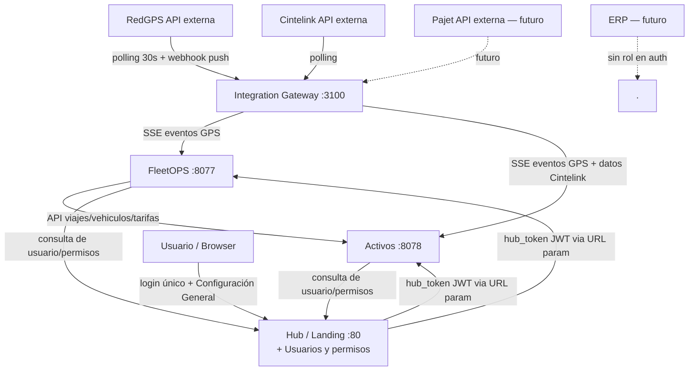

# ARQUITECTURA — Ecosistema de sistemas AB Construcciones

> **Propósito:** Context map del ecosistema completo. Define qué sistemas existen, qué hace cada uno, quién es dueño de qué datos, cómo se comunican y en qué entorno corre cada uno.
> **Audiencia:** Todo el equipo (expertos de proceso + devs de producción).
> **Fuente de verdad:** Este archivo versionado en el repo `ab-arquitectura`.
> **Última actualización:** Abril 2026
> **Responsable de mantenimiento:** Alejandro

---

## 1. Visión general

AB Construcciones SRL es un grupo de 14+ empresas (incluye Corralón El Mercado, VIAP, y otras). El ecosistema de sistemas internos busca unificar la gestión operativa sin acoplar las bases de datos de los módulos.

**Principio rector:** cada módulo es dueño de su dominio (su propia base de datos) y se comunica con otros módulos únicamente por API HTTP. Ningún módulo lee o escribe datos de otro directamente.

**Punto de entrada único:** el Hub (`http://157.245.219.73`, puerto 80) centraliza el login, la navegación entre módulos y — desde la próxima migración — la gestión de usuarios y permisos.

**Integraciones externas centralizadas:** todo servicio externo (RedGPS, Cintelink, Pajet) se consume a través del **Integration Gateway**. Los módulos nunca llaman directo a APIs externas.

---

## 2. Inventario de sistemas

| Sistema | Estado | Dominio | Puerto | URL producción |
|---------|--------|---------|--------|---------------|
| **Hub / Landing** | ✅ Producción | Login SSO, navegación, **usuarios y permisos** (en migración) | 80 | `http://157.245.219.73` |
| **FleetOPS** | ✅ Producción | GPS, tracking, viajes libres y programados, alertas, geocercas | 8077 | `http://157.245.219.73:8077` |
| **Integration Gateway** | ✅ Producción | Proxy único a servicios externos: RedGPS, Cintelink, (Pajet futuro). Distribución SSE a módulos | 3100 | interno, no expuesto |
| **Activos** | ✅ Producción | Equipos, inmuebles, herramientas, documentos, vencimientos, mantenimiento, combustible | 8078 | `http://157.245.219.73:8078` |
| **Configuración General** | ⏳ A construir | Administración de usuarios, empresas y permisos por módulo (vive dentro del Hub) | 80 | `http://157.245.219.73/config` (reservado) |
| **ERP** | ⏳ Futuro | Contabilidad, RRHH, costos | TBD | — |

> **Notas importantes:**
> - "Sistema Viajes" no es un sistema separado. Los viajes (libres y programados) son parte del dominio de FleetOPS.
> - El módulo **"Activos"** cubre equipos + inmuebles + herramientas. El repo se llama `ab-equipos` por razones históricas pero el producto es Activos.
> - El **ERP** ya no es el dueño de la autenticación. Esa responsabilidad queda en el Hub.

---

## 3. Mapa de dependencias



**Flujo de login SSO (objetivo):**
1. Usuario entra al Hub (`157.245.219.73:80`) y se loguea.
2. Hub valida credenciales contra tabla `hub_usuarios` propia.
3. Hub genera JWT con payload `{ userId, email, empresas: [...], permisos: { fleetops: "admin", activos: "operador" } }` y lo guarda en su `localStorage`.
4. Al hacer clic en un módulo, Hub redirige a `http://IP:PORT/?hub_token=JWT`.
5. El módulo lee `hub_token`, lo guarda en su `localStorage` y limpia la URL.
6. El módulo usa el JWT para autenticar las requests; si necesita datos del usuario o verificar permisos finos, consulta a la API del Hub (`GET /api/usuarios/:id`, `GET /api/permisos/:userId/:modulo`).

**Flujo actual (legacy, a migrar):** cada módulo tiene su tabla de usuarios propia (`fleetops_usuarios`, `equipos_usuarios`) y autentica contra ella. Mantendrá compatibilidad hasta que la migración al Hub finalice.

---

## 4. Bounded contexts (dueños de datos)

### Hub / Landing
**Dueño de:** usuarios del grupo, empresas, permisos por módulo, sesiones de hub (`ab_hub_session`), auditoría de login.
**Tablas (BD `hub`):** `hub_usuarios`, `hub_empresas`, `hub_permisos`, `hub_sesiones`, `hub_audit_log`.
**Tablas legacy a deprecar:** `fleetops_usuarios`, `equipos_usuarios` (se migran al Hub).

### FleetOPS
**Dueño de:** recorridos GPS, viajes libres, viajes programados, geocercas, alertas geográficas, configuración de flota, unidades de negocio (divisiones), tarifas, histórico de posiciones.
**BD:** `fleetops` (contenedor MySQL compartido con otras BDs).
**No es dueño de:** usuarios (los consulta al Hub), datos maestros de equipos (son de Activos), ubicaciones en tiempo real (las provee el Integration Gateway).

### Integration Gateway
**Dueño de:** última ubicación conocida de cada equipo, histórico de posiciones en memoria, estado de tokens de servicios externos (RedGPS cada 6h, Cintelink según proveedor), cache de respuestas de APIs externas.
**BD:** ninguna. Todo en memoria o proxy al servicio externo.
**No es dueño de:** ningún dato de negocio. Solo orquestación y proxy.

### Activos
**Dueño de:** equipos (maquinaria pesada, vehículos), inmuebles, herramientas, documentos adjuntos, vencimientos (VTV, CRIM, habilitaciones, contratos), semáforo documental, mantenimiento preventivo/correctivo, horas de uso, partes diarios, historial de asignaciones a obras y empresas, cargas de combustible, valuaciones, **vinculaciones con sistemas externos** (el mapeo `codigoInterno ↔ código en RedGPS / Cintelink / Pajet`).
**BD:** `activos` (nueva, ex tablas `equipos_*` en `fleetops`).
**No es dueño de:** usuarios (los consulta al Hub), ubicación GPS (la consulta al Gateway), viajes activos (los consulta a FleetOPS), combustible crudo (lo consulta al Gateway vía `/api/cintelink/*`).

**Identidad de activos y sistemas externos:**
- Cada activo tiene un `codigoInterno` autogenerado con formato `{empresa}-{CAT}-{letraTipo}{seq:03}` (ej: `AB-EQ-A003`).
- La correspondencia con los identificadores de sistemas externos (ej: código `A003` de RedGPS, `codigoCintelink`, futuro Pajet) vive en la tabla `equipos_vinculaciones_externas` con constraint unique `(sistemaExterno, codigoExterno)`.
- Activos es el **dueño único** del mapeo. Otros módulos resuelven vía `POST /api/vinculaciones/resolver` o el Gateway cachea el mapping en memoria.
- Ver ADR-009 y `06-PLAN-MIGRACION.md` §M3 para el detalle.

### ERP (futuro)
**Dueño de:** contabilidad, RRHH, costos, estructura organizacional del grupo.
**No es dueño de:** autenticación (eso es del Hub).

---

## 5. Contratos de comunicación entre sistemas

| Consumidor | Proveedor | Endpoint | Propósito |
|------------|-----------|----------|-----------|
| FleetOPS, Activos | Hub | `GET /api/usuarios/:id` | Datos del usuario (nombre, email, empresas) |
| FleetOPS, Activos | Hub | `GET /api/permisos/:userId/:modulo` | Validar permisos del usuario en el módulo |
| FleetOPS, Gateway | Activos | `POST /api/vinculaciones/resolver` | Resolver `(sistemaExterno, codigoExterno) → activoId` |
| FleetOPS, Gateway | Activos | `GET /api/vinculaciones?sistema=REDGPS` | Listado completo de vinculaciones para cacheo |
| FleetOPS | Integration Gateway | `GET /api/vehicles` | Lista de equipos con estado GPS |
| FleetOPS | Integration Gateway | `GET /api/stream` (SSE) | Stream de posiciones, geocercas, alertas |
| FleetOPS | Integration Gateway | `POST /api/webhook/redgps` | Recibir alertas push de RedGPS |
| Activos | Integration Gateway | `GET /api/vehicles` | Lista de equipos con estado GPS |
| Activos | Integration Gateway | `GET /api/stream` (SSE) | Stream de eventos GPS |
| Activos | Integration Gateway | `GET /api/cintelink/status` | Estado de la integración Cintelink |
| Activos | Integration Gateway | `GET /api/cintelink/tanques` | Tanques de combustible |
| Activos | Integration Gateway | `GET /api/cintelink/transacciones` | Cargas de combustible |
| Activos | Integration Gateway | `GET /api/cintelink/estaciones` | Estaciones de combustible |
| Activos | FleetOPS | `GET /api/viajes/libres` | Viajes del día por equipo |
| Activos | FleetOPS | `GET /api/vehiculos` | Estado de flota |

> Detalle completo de cada contrato (request/response, errores, versionado) en el repo `ab-contratos-api` como archivos OpenAPI.

---

## 6. Base de datos — una instancia, múltiples bases

Se usa un único servidor MySQL 8.4 (un solo contenedor Docker `fleetops_db`) con **múltiples bases de datos separadas**, una por módulo. Cada módulo tiene un usuario MySQL con `GRANT` limitado a **su propia BD**.

| Módulo | Base de datos | Usuario MySQL | Permisos |
|--------|---------------|---------------|----------|
| Hub | `hub` | `hub_user` | `GRANT ALL ON hub.*` |
| FleetOPS | `fleetops` | `fleetops` | `GRANT ALL ON fleetops.*` |
| Activos | `activos` | `activos_user` | `GRANT ALL ON activos.*` |
| (Integration Gateway) | — | — | No tiene BD |
| ERP (futuro) | `erp` | `erp_user` | `GRANT ALL ON erp.*` |

**Por qué BDs separadas (y no prefijos en una BD compartida):** ya hubo un incidente donde un módulo borró tablas del otro. El modelo intermedio de "BD única con prefijos + GRANT por prefijo" reduce el riesgo pero no lo elimina: un error humano o una herramienta automática mal configurada puede escribir fuera del prefijo. Con BDs separadas, MySQL mismo garantiza el aislamiento a nivel de privilegio. Ver ADR-001.

**Costo:** equivalente en RAM a tener una sola BD grande (la instancia MySQL es una sola). El único costo real es una migración inicial para separar las tablas que hoy conviven.

**Regla de oro:** ningún módulo hace `SELECT` o `INSERT` en tablas de otro módulo. Si necesita esos datos, hace una llamada HTTP a la API del módulo dueño.

---

## 7. Entornos de ejecución

| Entorno | Propósito | Ubicación | Quién despliega | Quién accede |
|---------|-----------|-----------|----------------|--------------|
| Local | Desarrollo individual | Máquina de cada dev | Cada dev en su máquina | Solo el dev |
| Staging / Discovery | Integración y pruebas | VM en la nube (futura) | Devs y expertos de proceso | Equipo + usuarios piloto |
| **Producción** | **Uso operativo real** | **VPS DigitalOcean `157.245.219.73`** | **Solo Alejandro** | **Usuarios finales** |

> **Nota actual:** hoy no existe entorno de staging formal. FleetOPS y Activos se desarrollaron directamente contra producción. Para los próximos módulos, se recomienda implementar staging antes del lanzamiento.

**Regla de oro:** nadie toca producción manualmente durante operación. Todo deploy pasa por build Docker + compose up.

---

## 8. Stack técnico estándar

| Capa | Tecnología |
|------|-----------|
| Frontend | React 18 + Vite + Tailwind CSS |
| Backend | Node.js + Express |
| ORM | **Prisma válido para módulos nuevos** (Activos ya lo usa). FleetOPS mantiene SQL raw con `mysql2` por historia del código. |
| Base de datos | MySQL 8.4, una instancia, múltiples BDs |
| Contenedorización | Docker + Docker Compose |
| Reverse proxy / Hub | Nginx |
| Timezone | `America/Argentina/Jujuy` (UTC-3, sin daylight saving) |
| Autenticación | **Usuarios centralizados en Hub.** JWT emitido por el Hub, validado por cada módulo usando `JWT_SECRET` compartido. Hub SSO via `?hub_token=` en URL. |

---

## 9. Convenciones transversales

- **BDs por módulo:** cada módulo en su propia BD. Un módulo nunca accede a BD ajena.
- **Nombres de tabla:** en cada BD, las tablas usan nombre simple (sin prefijo de módulo — la separación la da la BD). Ejemplo: BD `activos` tiene tabla `usuarios_historial`, no `equipos_usuarios_historial`. **Migración pendiente:** las tablas `equipos_*` dentro de `fleetops` se van a mover a BD `activos` y perderán el prefijo donde aplique.
- **Soft deletes:** tablas de negocio tienen `deleted_at DATETIME NULL` (SQL raw) o `deletedAt DateTime?` (Prisma).
- **Auditoría:** `created_at`/`updated_at` (FleetOPS) o `creadoEn`/`actualizadoEn` (Activos con Prisma). Ambas convenciones son válidas; cada módulo es consistente internamente.
- **IDs:** autoincremental (`INT AUTO_INCREMENT` / `@id @default(autoincrement())`).
- **Respuestas de API:** formato `{ data, error, meta }` cuando aplique. Endpoints públicos versionados bajo `/api/v1/`.
- **Paginación:** `?page=1&limit=50` con meta `{ total, pages, currentPage }`.
- **Fechas en API:** ISO 8601 con timezone explícito.
- **Idioma de campos en BD:** **español** (consistente en FleetOPS y Activos: `patente`, `empresa`, `nombre`, `viajes_libres`, `creadoEn`, etc.).
- **Códigos de asset:** formato `EMPRESA-CATEGORÍA-CÓDIGO` (ej: `AB-EQ-A002`, `VP-EQ-R021`).

---

## 10. Glosario del dominio

| Término | Significado |
|---------|-------------|
| Activo | Cualquier bien patrimonial gestionado (equipo, inmueble, herramienta). Dominio del sistema **Activos**. |
| Equipo | Maquinaria pesada (excavadora, retroexcavadora, camión, hormigonero, etc.). Es una categoría de Activo. |
| Inmueble | Terreno, edificio, oficina. Categoría de Activo. |
| Herramienta | Bien menor (taladro, amoladora, etc.). Categoría de Activo. |
| Parte diario | Registro diario de kilómetros y horas de un equipo |
| Semáforo documental | Verde/amarillo/rojo según vencimientos de documentos obligatorios |
| Bloqueo documental | Equipo no operable por documento obligatorio vencido |
| VTV | Verificación técnica vehicular — documento **obligatorio** |
| CRIM | Seguro — documento **opcional** (según tipo de equipo) |
| Viaje libre | Viaje detectado automáticamente por geocercas (apertura/cierre por GPS) |
| Viaje programado | Viaje planificado con origen/destino/horario definidos de antemano |
| Geocerca | Zona geográfica definida (polígono, círculo o línea) para detectar entradas/salidas |
| Empresa del grupo | Cualquiera de las 14+ razones sociales de AB Construcciones |
| Unidad de negocio | División operativa dentro del grupo (antes llamada "División") |
| Integration Gateway | Microservicio que centraliza las integraciones externas (RedGPS, Cintelink, Pajet) |
| Hub | Punto de entrada único del ecosistema. Login, navegación y usuarios/permisos. |

---

## 11. Decisiones arquitectónicas registradas (ADRs)

Las decisiones importantes se documentan como ADRs en `ab-arquitectura/adr/`.
Formato: `NNN-titulo-en-kebab-case.md`.

**ADRs vigentes:**
- `001-bases-de-datos-separadas-por-modulo.md` — Por qué cada módulo tiene su propia BD dentro de una única instancia MySQL. Reemplaza al modelo anterior de BD compartida con prefijos.
- `002-comunicacion-solo-por-api.md` — Prohibición de acceso cruzado a tablas ajenas.
- `003-integration-gateway-centralizado.md` — Por qué existe el microservicio único para integraciones externas (RedGPS + Cintelink + Pajet). Reemplaza al anterior "GPS Gateway" acotado solo a GPS.
- `004-prototipado-por-expertos.md` — Flujo de trabajo de prototipos a producción.
- `005-hub-sso-url-param.md` — Por qué el token JWT se pasa por URL param al navegar entre módulos (localStorage es origin-specific).
- `006-viajes-en-fleetops.md` — Decisión de que los viajes son dominio de FleetOPS, no de un sistema separado.
- `007-usuarios-centralizados-en-hub.md` — Por qué los usuarios viven en el Hub y no en cada módulo. Incluye el módulo de Configuración General.
- `008-activos-vs-equipos.md` — Aclaración de nombres: el sistema interno se llama "Activos" y cubre equipos + inmuebles + herramientas; el repo `ab-equipos` persiste por historia.
- `009-vinculaciones-externas-en-activos.md` — Por qué el mapeo entre `codigoInterno` y los identificadores de RedGPS / Cintelink / Pajet vive en Activos (tabla genérica `equipos_vinculaciones_externas`) y no en el Gateway ni en cada módulo consumidor.

---

## 12. Estructura de repos en GitHub

```
ab-construcciones/
├── ab-arquitectura        ← este documento + context map + ADRs
├── ab-dev-standards       ← CLAUDE.md maestro + CONSIDERACIONES + PROTOCOLO-HANDOFF
├── ab-contratos-api       ← OpenAPI specs de todos los contratos entre sistemas
├── fleetops-v2            ← FleetOPS (prototipo + producción, mismo repo hoy)
├── ab-equipos             ← Sistema Activos (producción; el repo conserva el nombre histórico)
├── integration-gateway    ← Microservicio único de integraciones externas (antes gps-gateway)
├── hub-ab                 ← Hub + módulo Configuración General (usuarios, permisos)
└── erp-ab                 ← futuro
```

---

## 13. Cambios a este documento

Este documento se revisa al iniciar cada módulo nuevo y al finalizar cada discovery sprint. Los cambios requieren pull request con review de al menos Alejandro.
